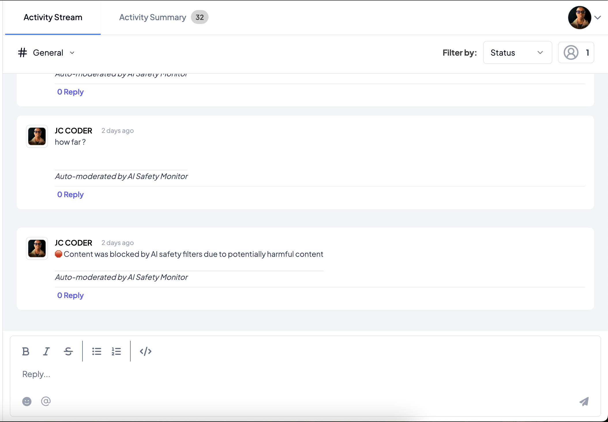
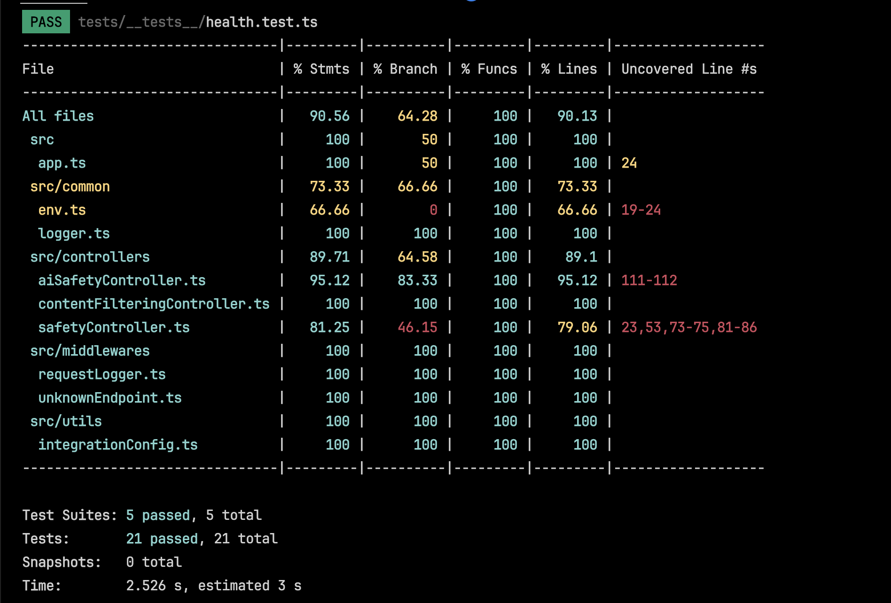

# AI Safety Monitor - Content Moderation Integration

An AI-powered content moderation system that automatically monitors and filters messages for safety concerns using advanced AI technology. This integration provides real-time content analysis to ensure safe and appropriate communication within your platform.

## Table of Contents

- [Overview](#overview)
- [Features](#features)
- [Prerequisites](#prerequisites)
- [Installation](#installation)
- [Configuration](#configuration)
- [Usage](#usage)
- [API Documentation](#api-documentation)
- [Testing](#testing)
- [Development](#development)
- [Contributing](#contributing)
- [License](#license)

## Overview

AI Safety Monitor is a robust content moderation system that combines multiple layers of protection:
- Basic content filtering for profanity and sensitive data
- AI-powered context analysis using Google's Gemini API
- Customizable moderation rules and thresholds
- Real-time webhook integration for instant feedback

## Features

- **Multi-Layer Content Analysis:**
  - Profanity detection and filtering
  - Sensitive data protection (credit cards, emails, phone numbers, SSNs)
  - Spam detection
  - AI-powered context analysis

- **Advanced AI Integration:**
  - Powered by Google's Gemini API
  - Context-aware content evaluation
  - Customizable AI prompts for specific use cases
  - Configurable safety thresholds

- **Customizable Settings:**
  - Configurable banned word lists
  - Adjustable safety score thresholds
  - Maximum message length limits
  - Custom AI analysis prompts

- **Real-time Processing:**
  - Webhook-based integration
  - Instant moderation feedback
  - Detailed safety analysis results
  - Admin notifications for flagged content

### AI Filter Showcase

*Example of AI Safety Monitor detecting and filtering inappropriate content in real-time*

## Prerequisites

- Node.js (v14 or higher)
- npm or yarn
- Google Gemini API key

## Installation

1. Clone the repository:
   ```bash
   git clone https://github.com/telexintegrations/ai-safety-monitor.git
   cd ai-safety-monitor
   ```

2. Install dependencies:
   ```bash
   npm install
   ```

3. Create environment file:
   ```bash
   cp .env.example .env
   ```

4. Configure your environment variables in `.env`:
   ```
   PORT=3000
   NODE_ENV=development
   TELEX_CHANNEL_ID=your_channel_id_here
   TELEX_RETURN_URL=your_return_url_here
   WEBSITE_URL=your_website_url_here
   ```

## Configuration

The integration can be configured through the following settings:

1. **Banned Words:**
   - Customize the list of automatically blocked words
   - Default includes common profanity and harmful terms

2. **Safety Thresholds:**
   - `minSafetyScore`: Minimum safety score (0-1) for message approval
   - Default: 0.7

3. **Message Limits:**
   - `maxMessageLength`: Maximum allowed message length
   - Default: 1000 characters

4. **AI Analysis:**
   - `enableAICheck`: Toggle AI-powered analysis
   - `customPrompt`: Custom prompt for AI analysis
   - `geminiApiKey`: Google Gemini API key (required)

## Usage

### Webhook Integration

The integration exposes a webhook endpoint for real-time content moderation:

```bash
POST /webhook
Content-Type: application/json

{
  "message": "Content to analyze",
  "settings": [
    {
      "label": "bannedWords",
      "type": "text",
      "default": ["word1", "word2"]
    },
    {
      "label": "minSafetyScore",
      "type": "number",
      "default": 0.7
    }
    // ... other settings
  ]
}
```

### Response Format

```json
{
  "status": "success" | "blocked",
  "message": "Moderation result with explanation"
}
```

## API Documentation

### Endpoints

1. **Health Check**
   ```
   GET /health
   ```

2. **Integration Configuration**
   ```
   GET /integration-config
   ```

3. **Content Moderation Webhook**
   ```
   POST /webhook
   ```

## Testing

Run the test suite:

```bash
# Run all tests
npm run test

# Run tests with coverage
npm run test-coverage

# Run tests in debug mode
npm run debug-test
```

### Test Coverage Status

*Current test coverage metrics showing extensive testing across all components*

## Development

1. Start the development server:
   ```bash
   npm run dev
   ```

2. Available Scripts:
   - `npm run build`: Build for production
   - `npm run lint`: Run ESLint
   - `npm run lint:fix`: Fix linting issues
   - `npm run prettier:fix`: Format code

## Contributing

1. Fork the repository
2. Create your feature branch
3. Commit your changes
4. Push to the branch
5. Create a Pull Request

## License

This project is licensed under the MIT License - see the LICENSE file for details.
